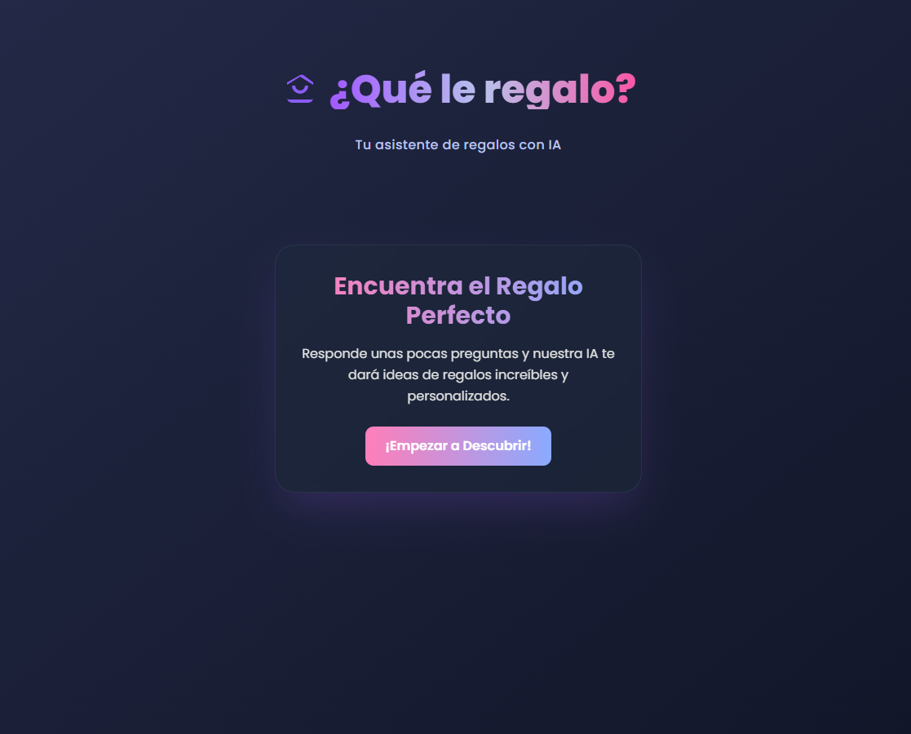

# 🎁 ¿Qué le regalo?


👉 **Live Demo**: [https://queleregalo.es/](#)

---

## ✨ ¿Qué es?
**¿Qué le regalo?** es una aplicación web con **IA** que te ayuda a encontrar el regalo perfecto para cualquier ocasión.  
Solo responde unas preguntas y deja que **Google Gemini** haga la magia.  

✔ **Interfaz moderna** (Glassmorphism + GSAP)  
✔ **Sugerencias adaptadas al perfil**  
✔ **Seguro y escalable** (serverless en Vercel)  

---

## 🚀 Stack Tecnológico
- **Frontend:** React + TypeScript + Tailwind + GSAP
- **Backend:** Vercel Functions (Serverless)
- **IA:** Google Gemini 1.5 Flash
- **Dev Tools:** Vite + Proxy local

---

## 🖼 Vista previa



---

## ⚡ Instalación rápida

```bash
# 1. Clonar repositorio
git clone <URL-del-repo>
cd que-le-regalo

# 2. Instalar dependencias
npm install

# 3. Ejecutar en modo completo (frontend + mock server)
npm run dev:full
````

✅ **Frontend:** [http://localhost:5173](http://localhost:5173)
✅ **Servidor mock:** [http://localhost:3001](http://localhost:3001)

---

### 🔑 Variables de Entorno

Para producción, configura en **Vercel**:

```
GEMINI_API_KEY=tu_clave_de_api
```

Obtén tu API key en [Google AI Studio](https://aistudio.google.com/app/apikey).

---

## 🌐 Despliegue en Vercel

1. Conecta el repositorio en [Vercel](https://vercel.com/).
2. Añade la variable **GEMINI\_API\_KEY** en **Environment Variables**.
3. Haz deploy (`git push`) y ¡listo!

---

## 🔍 Arquitectura

### **Arquitectura Inicial (Problema)**

* React → Gemini API (API Key expuesta ❌)

### **Arquitectura Final (Solución)**

* React → **Serverless Function (Vercel)** → Gemini API (API Key protegida ✅)

---

## 🛠 Características principales

* ✅ **Asistente IA** (Google Gemini)
* ✅ **Diseño premium**: Glassmorphism, gradientes, animaciones GSAP
* ✅ **Preguntas dinámicas y personalizables**
* ✅ **Experiencia responsive**
* ✅ **Backend seguro con Serverless Functions**

---

## 💡 ¿Por qué esta arquitectura?

* **Seguridad:** API Key oculta en backend.
* **Escalabilidad:** Funciones serverless en Vercel.
* **Desarrollo rápido:** Proxy local + mock data para testing.

---

## 📄 Estructura del proyecto

```
📂 src
 ┣ 📂 components    # Componentes UI
 ┣ 📂 services      # Conexión con IA (Gemini)
 ┣ 📂 api           # Funciones serverless (Vercel)
 ┣ 📜 constants.ts  # Preguntas y opciones
 ┣ 📜 App.tsx       # Lógica principal
 ┗ 📜 dev-server.js # Servidor mock para desarrollo
```

---

## 🔧 Solución de problemas

### Error `models/gemini-pro is not found`

* ✅ **Fallback automático**: Cambia a modelos disponibles.
* ✅ **Sugerencias por defecto**: Si falla la IA, usa opciones predefinidas.
* ✅ **Test rápido**:

```bash
node test-gemini.js
```

---

## 🙌 Créditos

* IA: [Google Gemini](https://aistudio.google.com/)
* Hosting: [Vercel](https://vercel.com/)
* Animaciones: [GSAP](https://gsap.com/)

---

⭐ **¿Te gustó el proyecto?** Dale una estrella en GitHub ⭐

